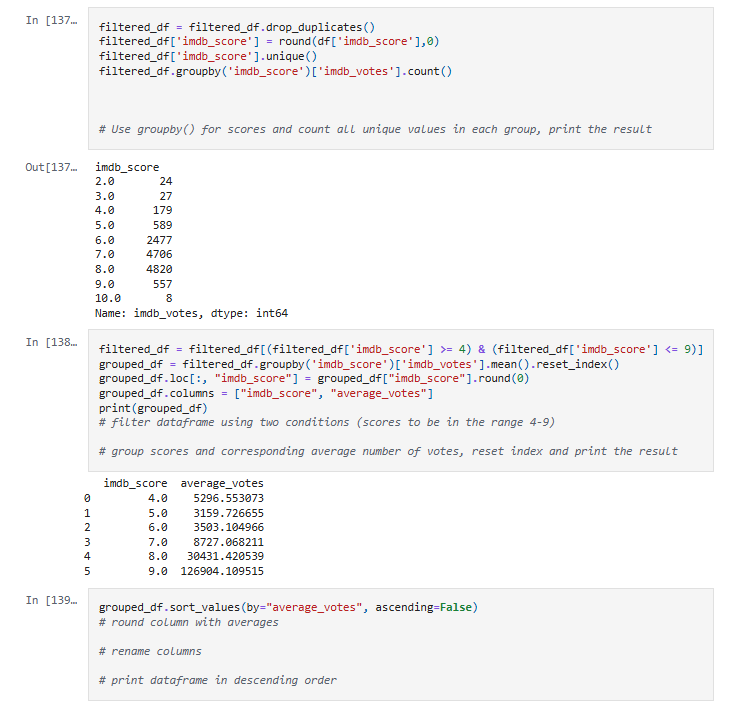
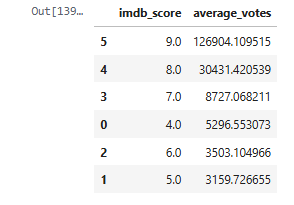

Basic Python: Project

[Basic Python Project](https://github.com/raulmejia000/Data_projects_TripleTen/blob/main/Basic%20Python%20Project/Basic%20Python%20Project%201.ipynb)

Sprint 1 – Working with Data in Python
Introduction

This project focused on practicing the fundamentals of Python and data analysis. The objective was to learn how to work with datasets, clean and transform the data, and carry out simple exploratory analysis. The goal was to understand how to prepare data for deeper insights and practice the first steps of becoming comfortable with Jupyter Notebook, pandas, and matplotlib.

What Was Done
- Imported and explored a dataset of entertainment industry records (movies and shows).
- Practiced basic Python operations: loops, functions, and conditional logic.
- Cleaned the dataset by handling missing values and adjusting data types.
- Created exploratory visualizations using matplotlib to understand distributions and relationships.
- Documented the steps in Jupyter Notebook with both code cells and Markdown explanations.

Tools & Libraries used:
Python, pandas, numpy, matplotlib, Jupyter Notebook.

Features (Screenshots)
Examples of project outputs include:
- Data cleaning steps in code cells.
- Visualizations showing filtered dataframe

Results
- Successfully applied Python fundamentals to manipulate and analyze real-world-like data.
- Produced simple yet effective visualizations that confirmed patterns in the dataset.
- Gained confidence in using pandas for data wrangling and matplotlib for charting.

Improvements & Business Suggestions
- Improvements: Future work could include using seaborn for more advanced visualizations or adding hypothesis testing.
- Business Outcomes: Analysts could use this type of analysis as a baseline for understanding audience behavior and trends in entertainment data.
