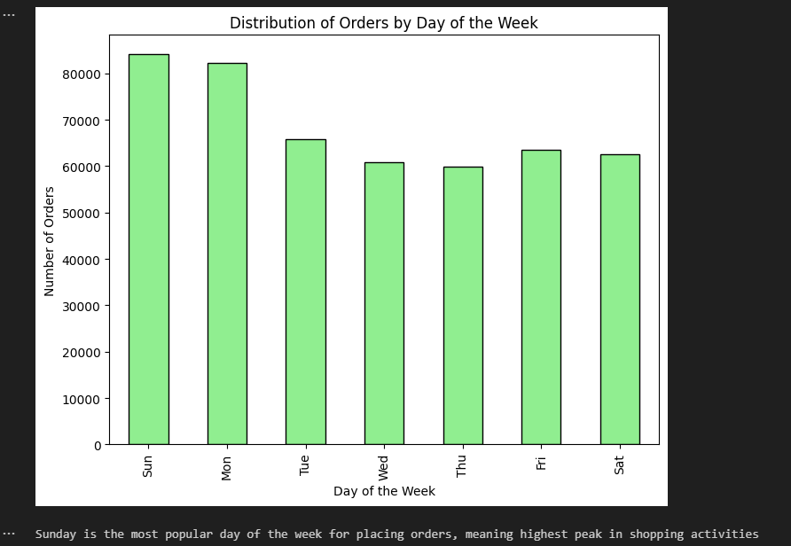

Instacart EDA Project

[Instacart EDA Project](https://github.com/raulmejia000/Data_projects_TripleTen/blob/main/Instacart%20EDA%20Project/Instacart%20EDA%20project%202.ipynb)

Introduction

The goal of this project was to perform an exploratory data analysis (EDA) on the Instacart dataset to uncover key shopping trends. By investigating ordering behavior, product demand, and time-based purchasing patterns, the objective was to generate insights into customer activity that could be useful for business decision-making.

What Was Done
- Imported and explored multiple datasets (orders.csv, products.csv, aisles.csv, departments.csv).
- Cleaned the data by handling missing values, correcting data types, and removing duplicates.
- Joined datasets together to create a unified view of customer orders and product details.
- Generated summary statistics and frequency counts for product demand, order timing, and aisle popularity.
- Built visualizations to reveal patterns such as most ordered products, busiest order hours, and most popular departments.

Tools & Libraries used:
Python, pandas, numpy, matplotlib, seaborn, Jupyter Notebook.

Features (Screenshots)

Busiest day of the week

Top 20 popular products

Results
- Identified the top products and most popular aisles in the dataset.
- Found that customer orders peak during weekends and late afternoons.
- Discovered that a small group of aisles contributes to a large portion of Instacart’s overall sales.
- Demonstrated the importance of data cleaning and joining multiple datasets to unlock insights.

Improvements & Business Suggestions

Improvements:
- Use advanced visualizations (heatmaps, interactive dashboards) to make results more dynamic.
- Incorporate machine learning to predict next product purchases.

Business Outcomes:
- Instacart can optimize delivery slots during peak order times.
- Marketing campaigns can be targeted around the most popular aisles and frequently purchased items.
- Product placement and recommendations can be improved to boost cross-sells.
